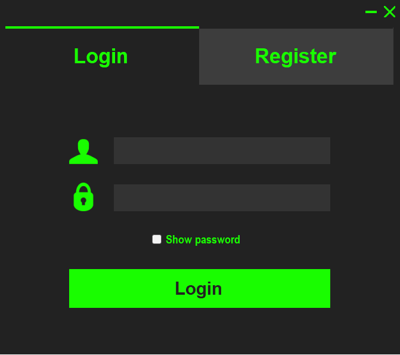
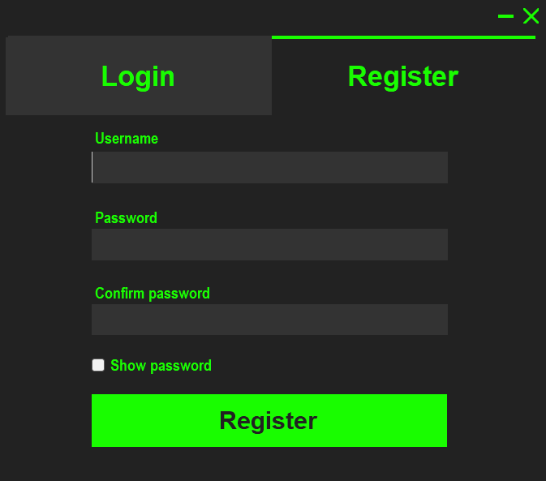

# VB.NET Login and Registration Form
This repository contains a simple yet functional login and registration form system developed in Visual Basic .NET, demonstrating fundamental user authentication processes. This application interfaces with a MySQL database, managed through XAMPP, to handle user data.

## Features
User Registration: New users can create an account by providing a username and password. The system also includes a password confirmation field for validation.
User Login: Existing users can log in using their credentials. The form includes a "Show password" feature for convenience.
MySQL Database Integration: User credentials are stored and managed in a MySQL database.
## Screenshots

## Prerequisites
Microsoft Visual Studio (or compatible IDE for .NET development)
XAMPP (for MySQL and Apache server simulation)
## Database Setup
Start XAMPP and initialize the MySQL and Apache servers.
Create a new database named Authentication.
Inside the Authentication database, create a table named users with two columns: UserName and Password.
## Installation
Clone the repository to your local machine.
Open the solution file in Visual Studio.
Ensure XAMPP servers are running and the MySQL database is configured as mentioned above.
Build and run the application within Visual Studio.
## Usage
Upon launching the application, users will be greeted with the login form. New users can switch to the registration form to create a new account. Once registered, users can log in to the system using their chosen credentials.
